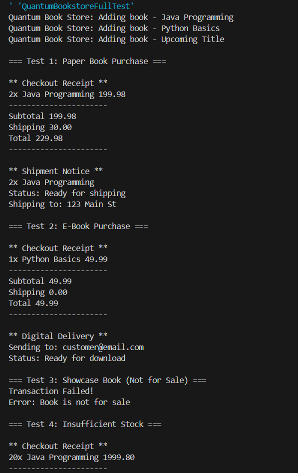
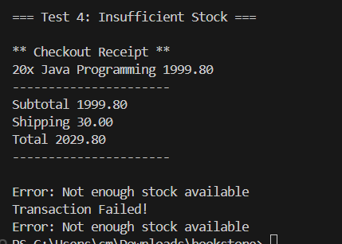

## Quantum Bookstore

A Java-based online bookstore system that manages different types of books: paper books, ebooks, and showcase books.

### Features

-   Add books to inventory
-   Process book purchases
-   Handle shipping for paper books
-   Handle digital delivery for ebooks
-   Manage book stock
-   Remove outdated books

### Termenal output

